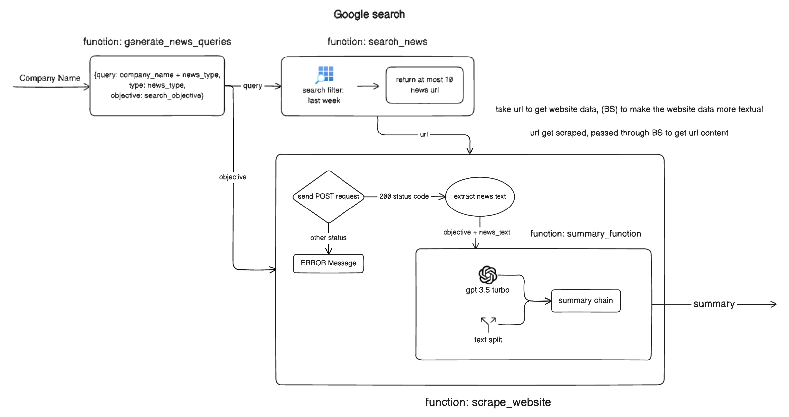
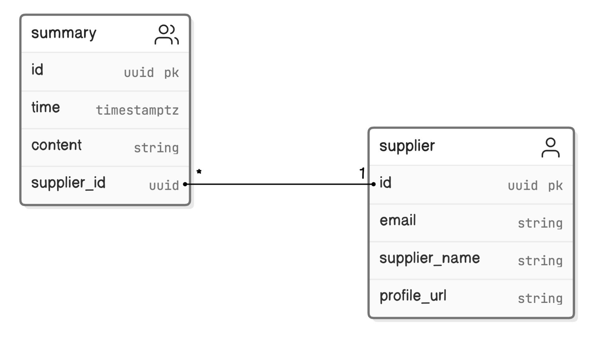

# Company News Collecter

The Company News Collecter is a scalable backend API built for gathering, scraping, and summarizing relevant business news from various online sources.
It integrates the Google Serper API for news search, the Browserless API for web scraping, and OpenAI's GPT-3.5 model for summarization. The tool efficiently retrieves up-to-date news articles based on specific queries, extracts content from targeted websites, and generates concise summaries tailored to specific business objectives.
The project employs a map-reduce method for summarization by spliting the text into manageable chunks, processing each chunk to extract key insights, and then combining the results to produce the summary.
By customizing the search queries and objectives, users can tailor the focus on aspects like financial health, corporate announcements, supply chain stability, market position, and regulatory compliance of supplier companies.

Flow chart of News Collecting Agent:



# Technologies Used

- **FastAPI**: For creating the backend API.
- **Supabase**: As the backend PostgreSQL database and for authentication.
- **LangChain**: For integrating language models and building chains for summarization and analysis.
- **OpenAI GPT-3.5**: For generating summaries and extracting key business insights.
- **Pydantic**: Data validation for url and news objectives.
- **Render**: For deployment and hosting.


## Before start: Supabase Setup

To get started with Supabase, follow these steps to set up your database and insert the necessary schema.

### Step 1: Create a Supabase Account

1. Go to the [Supabase website](https://supabase.io/).
2. Sign up for a new account or log in if you already have one.

### Step 2: Create a New Project

1. After logging in, click on the "New Project" button.
2. Fill in the required details:
   - **Project Name**: Give your project a name.
   - **Organization**: Select your organization or create a new one.
   - **Database Password**: Set a strong password for your database.

3. Click on "Create New Project".

### Step 3: Retrieve Project Credentials

1. Once the project is created, navigate to the "Settings" tab.
2. Click on "API" to find your `SUPABASE_URL` and `SUPABASE_KEY`.
3. Copy these credentials and add them to your `.env` file as shown in the setup tutorial.

### Step 4: Set Up the Database Schema

1. Go to the "Table Editor" tab in your Supabase project.
2. Click on "New Table" to create the tables required for your application.

Refer to the schema diagram in the `graph` folder for the table structure. Use the following SQL commands to initialize the tables:

```sql
CREATE TABLE supplier (
  id UUID PRIMARY KEY DEFAULT gen_random_uuid(),
  email VARCHAR(255),
  supplier_name VARCHAR(255),
  profile_url VARCHAR(255)
);

CREATE TABLE summary (
  id UUID PRIMARY KEY DEFAULT gen_random_uuid(),
  time TIMESTAMPTZ DEFAULT NOW(),
  content TEXT,
  news_url TEXT,
  news_title TEXT,
  supplier_id UUID REFERENCES supplier(id)
);
```

### Step 5: Insert Sample Data
Use the following SQL command to insert dummy company information for testing purposes:

```sql
INSERT INTO supplier (email, supplier_name, profile_url) VALUES
('contact@tesla.com', 'Tesla', 'https://www.tesla.com/profile'),
('support@apple.com', 'Apple', 'https://www.apple.com/profile');
('info@nvidia.com', 'Nvidia', 'https://www.nvidia.com/profile');
```

### Step 6: Test the Database Connection
To ensure that your Supabase setup is correct, you can test the connection by running a simple query from your application.

```Python
from supabase import create_client

SUPABASE_URL = os.getenv("SUPABASE_URL")
SUPABASE_KEY = os.getenv("SUPABASE_KEY")
supabase = create_client(SUPABASE_URL, SUPABASE_KEY)

data = supabase.table('supplier').select('*').execute()
print(data)
```
### Extra SQL Command for Cleaning Up Unnecessary Summaries
After running the tool in practice, you might want to filter out irrelevant summarizations. Use the following SQL command to delete entries with "NOT RELEVANT" content or null values:

```sql
DELETE FROM summary
WHERE content LIKE '%NOT RELEVANT%' OR content IS NULL;
```
### Schema Diagram



## Startup Tutorial for Company News Collector

This tutorial will guide you through the setup and usage of the Company News Collector tool. Follow these steps to get the tool up and running.

### Prerequisites

1. **Python 3.8+**: Ensure you have Python installed on your machine.
2. **pip**: Python package installer.
3. **Environment Variables**: Create a `.env` file in the project root with the following variables:
    - `SUPABASE_URL`
    - `SUPABASE_KEY`
    - `BROWSERLESS_API_KEY`
    - `SERP_API_KEY`
    - `OPENAI_API_KEY`

### Step 1: Clone the Repository

Clone the repository from your version control system.

```bash
git clone <repository_url>
cd <repository_directory>
```

### Step 2: Install Dependencies
Install the necessary Python packages using pip.

```bash
pip install -r requirements.txt
```

### Step 3: Set Up Environment Variables
Create a .env file in the root directory of your project and add the necessary environment variables.

```bash
touch .env
```
Add the following content to the .env file:

```
SUPABASE_URL=your_supabase_url
SUPABASE_KEY=your_supabase_key
BROWSERLESS_API_KEY=your_browserless_api_key
SERP_API_KEY=your_serp_api_key
OPENAI_API_KEY=your_openai_api_key
```

### Step 4: Run the FastAPI Server
Start the FastAPI server to make the tool accessible.

```bash
uvicorn app:app --host 127.0.0.1 --port 8000 --reload
```

### API Endpoint
- **POST /scrape/**: Starts the scraping and summarizing process for all suppliers.

To start the scraping process, you can send a POST request to the /scrape/ endpoint.
```bash
curl -X POST "http://127.0.0.1:8000/scrape/"
```

### Example usage
Here's an example of how to directly test the functionality in a Python script:

```Python
from ai_agent import generate_news_queries, search_news, scrape_website

acg_query = generate_news_queries('AGC Incorporated')
acg_financial_news = search_news(acg_query[4]['query'])
acg_f_news_1 = scrape_website(acg_query[4]['objective'], acg_financial_news[1]['link'])
print(acg_f_news_1)
print(acg_financial_news[1]['link'])
```


## Demo Deployment on Render (Optional)

By following these steps, you will have your Company News Collector tool deployed on Render, making it accessible for demonstration and testing purposes.
To deploy the Company News Information Collector on Render for demonstration purposes, follow these steps:

### Step 1: Create a Render Account

1. Go to the [Render website](https://render.com/).
2. Sign up for a new account or log in if you already have one.

### Step 2: Create a New Web Service

1. After logging in, click on the "New" button and select "Web Service".
2. Connect your GitHub or GitLab account to Render and select the repository containing your project.

### Step 3: Configure the Web Service

1. Fill in the required details:
   - **Name**: Give your web service a name.
   - **Region**: Choose a region closest to your user base.
   - **Branch**: Select the branch you want to deploy (e.g., `main`).
   - **Build Command**: `pip install -r requirements.txt`
   - **Start Command**: `uvicorn app:app --host 0.0.0.0 --port $PORT`

2. Add the environment variables required for your project in the "Advanced" section:
   - `SUPABASE_URL`
   - `SUPABASE_KEY`
   - `BROWSERLESS_API_KEY`
   - `SERP_API_KEY`
   - `OPENAI_API_KEY`

3. Click on "Add Environment Variable" and input each variable with its corresponding value from your `.env` file.

### Step 4: Deploy the Service

1. Review the settings and click on "Create Web Service".
2. Render will start building and deploying your application. This process may take a few minutes.

### Step 5: Access Your Deployed Service

1. Once the deployment is complete, Render will provide you with a URL for your web service.
2. You can now access your application through this URL.

### Step 6: Test the API Endpoint

To test your deployed application, send a POST request to the `/scrape/` endpoint using a tool like `curl` or Postman:

```bash
curl -X POST "https://<your-render-url>/scrape/"
```

Replace `<your-render-url>` with the URL provided by Render.

### Example Deployment Configuration

Here is an example of what your Render deployment configuration might look like:

- **Name**: company-news-collector
- **Region**: US East (Ohio)
- **Branch**: main
- **Build Command**: `pip install -r requirements.txt`
- **Start Command**: `uvicorn app:app --host 0.0.0.0 --port $PORT`


## License

This project is licensed under the MIT License - see the LICENSE.md file for details.
